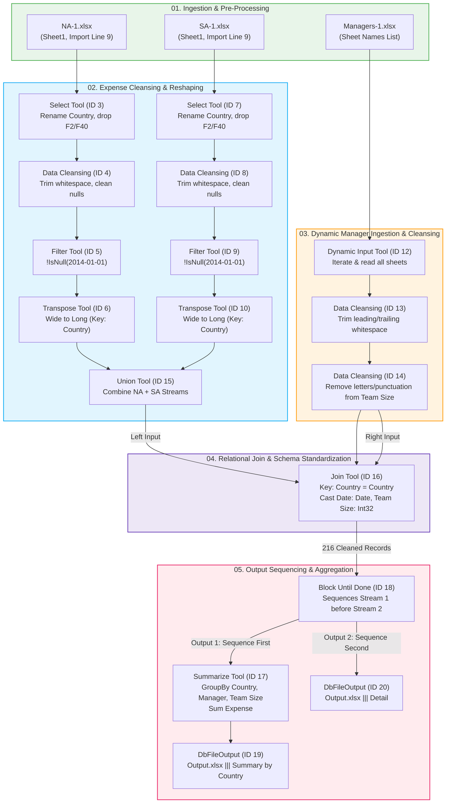

# Global Multi-Region Expense ETL & Reporting Automation

[](https://www.alteryx.com/)
[]()
[]()
[]()

An automated end-to-end Alteryx ETL pipeline designed to ingest, cleanse, reshape, and consolidate multi-regional financial expense data and organizational hierarchy structures. The workflow automates the normalization of wide-format monthly financial records across North America and South America, sanitizes messy organizational attributes across dynamic multi-sheet workbooks, and orchestrates sequential multi-tab Excel reporting.


## Project Overview

Financial reporting across global operating units frequently faces fragmentation due to disparate Excel spreadsheets, inconsistent cell formatting, merged title headers, wide-format date arrangements, and dirty organizational data. 

This project delivers a production-grade Alteryx workflow (`.yxmd`) and package (`.yxzp`) that:
- **Ingests heterogeneous regional files** without relying on manual cell selections.
- **Normalizes 36 months of horizontal financial records** (2014–2016) into structured time-series observations.
- **Dynamically reads multi-tab manager records** across global territories.
- **Sanitizes messy numeric/string fields** (stripping arbitrary text suffixes like `"135 EE"` or `"team of 15"` into pure integers).
- **Sequences dual-sheet Excel outputs** (`Summary by Country` and `Detail`) within a single target file using Alteryx's `Block Until Done` tool to prevent write collisions.

---

## Business Problem & Requirements

### Key Objectives
1. **Multi-File Ingestion**: Read North America (`NA-1.xlsx`), South America (`SA-1.xlsx`), and Management hierarchy (`Managers-1.xlsx`) by selecting entire sheets rather than fixed cell ranges.
2. **Cleansing & Filtering**:
   - Bypass title blocks, metadata stamps, and blank lines (table data begins at row 9).
   - Eliminate null rows, spacer columns, and hidden cell artifacts (`"Hidden Value - Don't Show!!!"`).
3. **Data Reshaping (Wide-to-Long)**:
   - Pivot horizontal monthly expense dates (`2014-01-01` through `2016-12-01`) into vertical records.
4. **Dynamic Multi-Sheet Ingestion**:
   - Extract the sheet list from `Managers-1.xlsx` and read all available regions (`North America`, `South America`, `Europe`) dynamically.
   - Cleanse whitespace and remove non-numeric characters from team size metrics.
5. **Relational Join & Aggregation**:
   - Join expense time-series with management data using `Country` as the primary key, resulting in exactly **216 detailed records** across **5 core variables**.
   - Aggregate total expenses by country and manager.
6. **Orchestrated Excel Delivery**:
   - Sequentially publish both the high-level summary and granular details into separate sheets of a unified `Output.xlsx` workbook without file access conflicts.
7. **Step-Count Efficiency**:
   - Execute the entire end-to-end transformation within a strict **28-tool limit**.

---

## Pipeline Architecture



---

## Data Engineering Methodology

### 1. Ingestion & Header Handling
- **Problem**: Raw regional expense sheets (`NA-1.xlsx` and `SA-1.xlsx`) contain title metadata, empty rows, and note banners spanning rows 1 through 8.
- **Solution**: The input configuration sets `ImportLine = 9`. This directly maps row 9 as the field header, bringing in `Country` (`F1`) and monthly columns (`2014-01-01` through `2016-12-01`) while bypassing blank lines.

### 2. Cleansing & Filtering Artifacts
- **Problem**: Hidden spreadsheet notes (e.g. `"Hidden Value - Don't Show!!!"` and `"WASTED SPACE"`) contaminate rows.
- **Solution**: 
  - `Select Tool`: Drops unwanted artifact columns (`F2`, `Date>>>`, `F40`).
  - `Data Cleansing Tool`: Strips leading and trailing whitespaces.
  - `Filter Tool`: Filters records on `!IsNull([2014-01-01])`, purging blank spacer rows and lingering header artifacts.

### 3. Unpivoting Wide-to-Long (Transpose)
- **Problem**: Monthly expense values are spread horizontally across 36 columns (`2014-01-01` to `2016-12-01`). Relational joining and time-series aggregation require normalized vertical rows.
- **Solution**: `Transpose Tool` keeps `Country` as the Key Field and pivots all 36 date fields into two normalized columns:
  - `Name`: Target date string.
  - `Value`: Numerical expense amount.
- **Consolidation**: A `Union Tool` stacks the cleaned North American (3 countries × 36 months = 108 rows) and South American (3 countries × 36 months = 108 rows) streams into a single dataset of **216 rows**.

### 4. Dynamic Manager Ingestion & String Sanitization
- **Problem**: Manager data is distributed across multiple worksheets (`North America`, `Europe`, `South America`) inside `Managers-1.xlsx`. Furthermore, the `Team Size` field contains unstructured text strings (`"135 EE"`, `"235 Ees"`, `"team of 15"`, `"10 Persons"`, `"24 Ppl"`), and country names contain irregular whitespace (`" Canada  "`, `" Chile "`).
- **Solution**:
  - `DbFileInput`: Ingests the list of sheet names (`<List of Sheet Names>`).
  - `Dynamic Input Tool`: Dynamically opens and appends records from each worksheet.
  - `Data Cleansing Tools`: Strips leading/trailing whitespace and removes letters, punctuation, and extraneous symbols from `Team Size`, converting dirty text strings into pure numeric representations.

### 5. Relational Join & Reconciliation
- **Problem**: Expense data must be enriched with regional management details. Unmatched records must be accounted for.
- **Solution**:
  - `Join Tool (ID 16)`: Joins on `Left.Country = Right.Country`.
  - Field renaming & casting:
    - `Left_Name` $\rightarrow$ `Date` (cast to `Date`, length 10).
    - `Left_Value` $\rightarrow$ `Expense` (Double).
    - `Right_Team Size` $\rightarrow$ `Team Size` (cast to `Int32`).
    - `Right_Country` $\rightarrow$ Deselected to eliminate redundancy.
  - **Reconciliation Check**:
    - **Join Stream (`J`)**: Exactly **216 records** (100% of expense observations matched).
    - **Left Unjoined (`L`)**: 0 records (no orphan expense records).
    - **Right Unjoined (`R`)**: 4 records (`United Kingdom`, `Austria`, `Italy`, `Spain` from the European division, which has no corresponding 2014–2016 expense entries in NA/SA files).

### 6. Aggregation & Multi-Tab Writing (Block Until Done)
- **Problem**: Excel files lock during write operations. Writing two sheets (`Summary by Country` and `Detail`) concurrently to `Output.xlsx` will trigger an OS-level file lock error.
- **Solution**:
  - `Block Until Done Tool (ID 18)` gates downstream execution.
  - **Output 1**: Pushes data to `Summarize Tool (ID 17)` (grouping by `Country`, `Manager`, `Team Size` and summing `Expense`), which writes to `Output.xlsx|||Summary by Country` with `Overwrite (Sheet/Range)` enabled.
  - **Output 2**: Once Output 1 finishes and releases the workbook file lock, Output 2 streams all 216 detailed records to `Output.xlsx|||Detail`.

---


---


```text
======================================================================
PIPELINE EXECUTION & RECONCILIATION SUMMARY
======================================================================
[+] Input Records Read:
    - North America Expenses  : 108 records (3 countries x 36 months)
    - South America Expenses  : 108 records (3 countries x 36 months)
    - Dynamic Manager Records : 10 records across 3 regions
[+] Cleaned Joined Records    : 216 records (100% match)
[+] Dropped Left Records      : 0 (No orphan expense entries)
[+] Unmatched Right Records   : 4 (European countries without expense data)
[+] Summary Tab Generated     : 6 countries (Brazil, Canada, Chile, Colombia, Mexico, US)
[+] Detail Tab Generated      : 216 rows x 5 attributes
======================================================================
```
